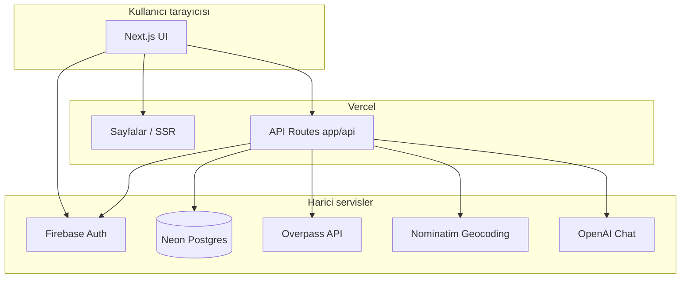

# PITON Akıllı Restoran Öneri Uygulaması

[PITON Technology](https://piton.com.tr) yazılım geliştirici adaylığı **take-home** projesi: konum tabanlı restoran/kafe keşfi, tercihlere göre sıralama, harita arayüzü ve kalıcı kullanıcı verisi.

| | |
|---|---|
| **Canlı demo** | [piton-restoran-oneri.vercel.app](https://piton-restoran-oneri.vercel.app) |
| **Kaynak kod** | [github.com/nazlicansahin/piton-restoran-oneri](https://github.com/nazlicansahin/piton-restoran-oneri) |
| **Stack** | Next.js 14 · TypeScript · Firebase Auth · Neon Postgres · Leaflet · Overpass API |

---

## İçindekiler

- [Ekran görüntüleri](#ekran-görüntüleri)
- [Özellikler](#özellikler)
- [Gereksinim karşılama tablosu](#gereksinim-karşılama-tablosu)
- [Mimari](#mimari)
- [Öneri algoritması](#öneri-algoritması)
- [Kurulum kılavuzu](#kurulum-kılavuzu)
- [Docker ile çalıştırma](#docker-ile-çalıştırma)
- [CI/CD](#cicd)
- [Production dağıtım (Vercel)](#production-dağıtım-vercel)
- [Testler](#testler)
- [Proje yapısı](#proje-yapısı)
- [API özeti](#api-özeti)
- [Performans ve önbellekleme](#performans-ve-önbellekleme)
- [Teslimat checklist](#teslimat-checklist)
- [Lisans](#lisans)

---

## Ekran görüntüleri

### Ana sayfa — harita, arama, öneriler (açık tema)


### Ana sayfa — koyu tema, İngilizce arayüz


### Giriş ekranı


---

## Özellikler

### Zorunlu kapsam

- **Konum ve harita** — Tarayıcı Geolocation API ile kullanıcı konumu; OpenStreetMap tabanlı interaktif harita (Leaflet). Haritaya tıklayarak arama merkezini değiştirme.
- **Canlı mekan verisi** — OpenStreetMap [Overpass API](https://wiki.openstreetmap.org/wiki/Overpass_API) üzerinden restoran, kafe ve fast food noktaları; adres eksikse Nominatim ile tamamlama.
- **Tercih ekranı** — Mutfak türü ve maksimum mesafe (km) seçimi; Postgres’e kayıt (giriş gerekli).
- **Öneri algoritması** — Mesafe ve mutfak uyumuna göre ağırlıklı skor; **Senin İçin En Uygun Mekanlar** listesi (en fazla 10).
- **Yakın mekan listesi** — Önerilerden ayrı, mesafeye göre sıralı **Diğer Yakın Mekanlar** (sayfa başına 10, sayfalama).
- **Kalıcı veri** — Firebase Auth kimliği + Neon Postgres (tercihler, favoriler, gruplar).
- **Konum arama** — Şehir veya adres ile arama (Nominatim proxy: `/api/geocode`).

### Bonus özellikler

| Özellik | Durum |
|---------|--------|
| Koyu / açık tema (`next-themes`) | ✅ |
| TR / EN dil desteği | ✅ |
| AI sohbet asistanı (`/api/chat`, OpenAI) | ✅ |
| Production deploy (Vercel) | ✅ |
| GitHub Actions CI | ✅ |
| Docker ile tek komutlu çalıştırma | ✅ |
| Skeleton yükleme durumları | ✅ |
| Favoriler şehre göre gruplama | ✅ |
| Sunucu tarafı mekan önbelleği | ✅ |

### Kimlik doğrulama

- **Google** ile giriş
- **E-posta / şifre** ile kayıt ve giriş
- Harita ve mekan listesi **giriş olmadan** görüntülenebilir; tercih kaydetme, favoriler ve gruplar **giriş gerektirir**.

---

## Gereksinim karşılama tablosu

PITON take-home dokümanındaki değerlendirme maddeleri ile proje eşlemesi:

| Öncelik | Gereksinim | Karşılama |
|---------|------------|-----------|
| Zorunlu | Konum + harita işaretçisi | `hooks/useGeolocation.ts`, `components/map/RestaurantMap.tsx` |
| Zorunlu | Canlı mekan verisi (ad, mutfak, adres) | `/api/places` → Overpass + Nominatim fallback |
| Zorunlu | Tercih ekranı | `components/preferences/PreferenceForm.tsx` |
| Zorunlu | Skorlama / sıralama algoritması | `lib/recommend.ts` — formül README’de açık |
| Zorunlu | Kalıcı veri (tercihler + beğeniler) | Neon Postgres + Firebase Auth |
| Zorunlu | README (kurulum, yapı, kullanım, ekran görüntüleri) | Bu dosya |
| Zorunlu | Kısa demo videosu | [Teslimat checklist](#teslimat-checklist) |
| Bonus | Koyu / açık mod | Header’daki tema anahtarı |
| Bonus | AI chatbot | `components/chat/RestaurantChat.tsx` |
| Bonus | Production deploy | Vercel |
| Bonus | i18n | `lib/i18n/*` |
| Bonus | GitHub Actions CI | `.github/workflows/ci.yml` |

---

## Mimari

Ayrı bir backend sunucusu yoktur. Next.js App Router hem UI hem de REST API (`app/api/*`) sağlar; Vercel’de serverless function olarak çalışır.



**Veri akışı (ana sayfa):**

1. GPS veya yedek konum → `searchCenter`
2. `GET /api/places?lat&lng&radius` → Overpass (5 dk sunucu önbelleği)
3. İstemci: mesafe hesaplama → harita + listeler
4. **Senin İçin:** `rankPlaces` → en yüksek skorlu 10 mekan
5. **Diğer Yakın:** öneri ID’leri hariç, mesafeye göre 10’ar sayfalı liste

Detaylı fonksiyon dokümantasyonu: [`docs/functions/`](docs/functions/README.md).

---

## Öneri algoritması

Skorlama `lib/recommend.ts` içinde **saf (pure)** ve deterministiktir; aynı girdi her zaman aynı sıralamayı üretir.

### Adımlar

1. **Sert filtre** — `distanceKm > maxDistanceKm` olan mekanlar elenir.
2. **Alt skorlar** (0–100):
   - **Mesafe:** `100 × (1 − distanceKm / maxDistanceKm)`
   - **Mutfak:** Seçili mutfakla tam eşleşme → 100; genel etiket yok → 30; kullanıcı mutfak seçmemişse → 50; aksi halde → 0
3. **Toplam skor:** `%50 mesafe + %50 mutfak`
4. **Sıralama:** Toplam skor ↓, mesafe ↑, isim ↑ (tie-break)

### Favoriler ve rozetler

- Favori mekanlar skora **ekstra puan almaz**; sıralama yalnızca mesafe + mutfak uyumuna dayanır.
- Daha önce favorilenen mutfaklar yalnızca **“Daha önce beğendiğin mutfak”** rozeti için kullanılır.

### Fiyat tercihi

OSM’de `price_range` etiketi Türkiye’de seyrek olduğundan, uygulama arayüzünde fiyat tercihi **kaldırılmıştır**. Veritabanı şemasında `price_preference` alanı geriye dönük uyumluluk için durabilir; skorlamada kullanılmaz.

---

## Kurulum kılavuzu

### Ön koşullar

- **Node.js 20+**
- **npm** (veya uyumlu paket yöneticisi)
- **Firebase** projesi (Auth: Google + Email/Password)
- **Neon** Postgres (veya uyumlu Postgres)
- *(Opsiyonel)* **Docker** — konteyner ile çalıştırma
- *(Opsiyonel)* **OpenAI API key** — AI sohbet için

### 1. Depoyu klonlayın

```bash
git clone https://github.com/nazlicansahin/piton-restoran-oneri.git
cd piton-restoran-oneri
npm install
```

### 2. Ortam değişkenleri

```bash
cp .env.example .env.local
```

`.env.local` dosyasını doldurun:

| Değişken | Açıklama | Zorunlu |
|----------|----------|---------|
| `NEXT_PUBLIC_FIREBASE_*` | Firebase web uygulaması yapılandırması | Evet |
| `FIREBASE_ADMIN_*` | Firebase Admin SDK (korumalı API rotaları) | Evet |
| `DATABASE_URL` | Neon **pooled** bağlantı dizesi (runtime) | Evet |
| `DATABASE_URL_UNPOOLED` | Neon **direct** bağlantı (migration için) | Migration |
| `OVERPASS_URL` | Overpass endpoint (varsayılan: overpass-api.de) | Hayır |
| `OPENAI_API_KEY` | AI sohbet (`/api/chat`) | Hayır |
| `OPENAI_CHAT_MODEL` | Model adı (varsayılan: `gpt-4o-mini`) | Hayır |

> **Güvenlik:** `.env.local` ve servis hesabı anahtarlarını asla repoya commit etmeyin.

### 3. Firebase yapılandırması

1. [Firebase Console](https://console.firebase.google.com/) → yeni proje
2. **Authentication** → Sign-in method: **Google** ve **Email/Password** etkin
3. Web uygulaması ekleyin → `NEXT_PUBLIC_*` değerlerini kopyalayın
4. **Project settings → Service accounts** → yeni private key → `FIREBASE_ADMIN_*` alanları

### 4. Veritabanı migration’ları

Neon’da boş bir veritabanı oluşturun. Migration’ları **sırayla** uygulayın:

```bash
# Doğrudan bağlantı dizesini export edin (Neon dashboard → Connection details → Direct)
export DATABASE_URL_UNPOOLED="postgresql://..."

# Şema: kullanıcılar, tercihler, mekanlar, favoriler, gruplar
npm run db:migrate

# Phase 2: grup favorileri, davetler
psql "$DATABASE_URL_UNPOOLED" -f db/migrations/002_phase2.sql

# places.city sütunu (favorilerde şehir gruplama)
npm run db:migrate:city
```

Runtime için Vercel / `.env.local` içinde **pooled** `DATABASE_URL` kullanın.

### 5. Geliştirme sunucusu

```bash
npm run dev
```

Tarayıcıda [http://localhost:3000](http://localhost:3000) adresini açın.

Konum izni verin veya haritada / arama kutusunda bir nokta seçin.

### 6. Production build (yerel doğrulama)

```bash
npm run lint
npm test
npm run build
npm start
```

---

## Docker ile çalıştırma

Çok aşamalı `Dockerfile` (deps → build → standalone runner) ve `docker-compose.yml` ile tek komut:

```bash
# .env.local hazır olmalı (Firebase + DATABASE_URL)
docker compose up --build
```

Uygulama [http://localhost:3000](http://localhost:3000) adresinde açılır.

> Docker imajı yalnızca **uygulama runtime**’ını paketler. Firebase Auth ve Neon Postgres harici yönetilen servislerdir; compose içinde DB konteyneri yoktur.

---

## CI/CD

GitHub Actions workflow: [`.github/workflows/ci.yml`](.github/workflows/ci.yml)

Her **push** ve **pull request** (`main` branch) tetikler:

| Job | Adımlar |
|-----|---------|
| **lint-and-build** | `npm ci` → `npm run lint` → `npm run build` |
| **docker-build** | Docker imajı build (push yok; derleme doğrulaması) |

Yerel kalite kontrolü:

```bash
npm run lint    # ESLint (Next.js config)
npm test        # Vitest birim testleri
npm run build   # Production build
```

> CI şu an `npm test` çalıştırmaz; testler yerel ve PR öncesi manuel çalıştırılmalıdır. İstenirse workflow’a eklenebilir.

### Branch stratejisi

- `main` — production (Vercel otomatik deploy)
- Feature branch → PR → CI yeşil → merge

---

## Production dağıtım (Vercel)

1. [Vercel](https://vercel.com) → **Import Git Repository** → `piton-restoran-oneri`
2. Framework preset: **Next.js** (otomatik algılanır)
3. **Environment Variables** — `.env.example` içindeki tüm değerleri **Production** (ve Preview) için ekleyin
4. Deploy

Vercel, `main` branch’e her push’ta otomatik yeniden deploy eder.

**Harici bağımlılıklar (Vercel dışında):**

| Servis | Rol |
|--------|-----|
| Firebase | Kimlik doğrulama |
| Neon Postgres | Kalıcı veri |
| Overpass / Nominatim | Mekan ve geocoding (ücretsiz, rate limit’e dikkat) |
| OpenAI | AI sohbet (opsiyonel) |

---

## Testler

[Vitest](https://vitest.dev/) ile birim testler:

```bash
npm test
```

Kapsanan modüller (örnek):

- `lib/recommend.test.ts` — skorlama ve sıralama
- `lib/cuisine.test.ts` — mutfak eşleme
- `lib/favorite-city.test.ts` — şehir gruplama

---

## Proje yapısı

```
piton-restoran-oneri/
├── app/
│   ├── page.tsx                 # Ana sayfa (harita, tercihler, listeler, chat)
│   ├── favorites/               # Favoriler (şehre göre gruplu)
│   ├── groups/                  # Grup listesi ve detay
│   ├── login/ · register/       # Auth sayfaları
│   └── api/                     # REST API (places, favorites, groups, chat, …)
├── components/
│   ├── map/                     # Leaflet harita
│   ├── places/                  # Mekan kartları, sayfalama
│   ├── preferences/             # Tercih formu
│   ├── chat/                    # AI sohbet paneli
│   ├── skeletons/               # Yükleme iskeletleri
│   └── ui/                      # shadcn/ui bileşenleri
├── hooks/                       # useGeolocation, useUserData, …
├── lib/
│   ├── recommend.ts             # Öneri algoritması
│   ├── overpass.ts              # Overpass sorgusu
│   ├── places-cache.ts          # Sunucu önbelleği
│   ├── db.ts                    # Neon client
│   └── i18n/                    # TR/EN sözlükler
├── db/migrations/               # SQL şema dosyaları
├── docs/functions/              # Fonksiyon dokümantasyonu
├── .github/workflows/ci.yml     # CI pipeline
├── Dockerfile
├── docker-compose.yml
└── .env.example
```

---

## API özeti

| Endpoint | Method | Auth | Açıklama |
|----------|--------|------|----------|
| `/api/places` | GET | Hayır | Yakın mekanlar (Overpass, önbellekli) |
| `/api/geocode` | GET | Hayır | Adres / şehir arama (Nominatim proxy) |
| `/api/me/preferences` | GET, PUT | Evet | Kullanıcı tercihleri |
| `/api/favorites` | GET, PUT | Evet | Favori listesi |
| `/api/favorites/[placeId]` | DELETE | Evet | Favoriden çıkar |
| `/api/groups` | GET, POST | Evet | Grup CRUD |
| `/api/groups/[id]/favorites` | GET, PUT | Evet | Grup favorileri |
| `/api/groups/[id]/invites` | POST | Evet | Grup daveti |
| `/api/chat` | POST | Evet | AI restoran asistanı |

Detay: [`docs/functions/`](docs/functions/README.md).

---

## Performans ve önbellekleme

| Konu | Çözüm |
|------|--------|
| Overpass gecikmesi | `lib/places-cache.ts` — `unstable_cache`, 5 dk TTL, koordinat/yarıçap bucket |
| İlk yükleme UX | Skeleton bileşenleri; stale-while-revalidate (liste güncellenirken eski veri görünür) |
| GPS gecikmesi | Yedek konum hemen uygulanır; `enableHighAccuracy: false` |
| Yarıçap kaydırıcısı | 450 ms debounce ile gereksiz API çağrısı azaltılır |
| Favori şehirleri | `places.city` DB’de saklanır; GET sırasında Nominatim çağrılmaz |

Overpass ve Nominatim **ücretsiz** servislerdir; yoğun kullanımda rate limit uygulanabilir. Production’da yük artarsa kendi Overpass instance’ı veya tile cache katmanı düşünülebilir.

---

## Teslimat checklist

PITON değerlendirme süreci için beklenen teslimatlar:

- [x] **Public GitHub deposu** — [nazlicansahin/piton-restoran-oneri](https://github.com/nazlicansahin/piton-restoran-oneri)
- [x] **README** — kurulum, mimari, algoritma, CI/CD, ekran görüntüleri (bu dosya)
- [x] **Kurulum kılavuzu** — npm + Docker yolları
- [x] **CI/CD** — GitHub Actions (lint + build + Docker build)
- [x] **Production deploy** — Vercel canlı URL
- [ ] **Demo videosu** — 3–5 dk ekran kaydı: konum, harita, tercih, öneriler, favori, (opsiyonel) grup ve AI chat; `hr@piton.com.tr` adresine paylaşım linki ile birlikte gönderilmeli

### Demo videosu önerilen akış

1. Canlı site veya `npm run dev` ile giriş
2. Konum izni / şehir araması
3. Haritada merkez değiştirme → listenin güncellenmesi
4. Mutfak tercihi değiştirme → **Senin İçin** listesinin değişmesi
5. Favori ekleme → **Favoriler** sayfasında şehir grupları
6. Koyu mod ve dil değiştirme
7. *(Bonus)* AI sohbet veya grup favorisi

---

## Lisans

Bu proje PITON Technology take-home değerlendirmesi kapsamında geliştirilmiştir.
