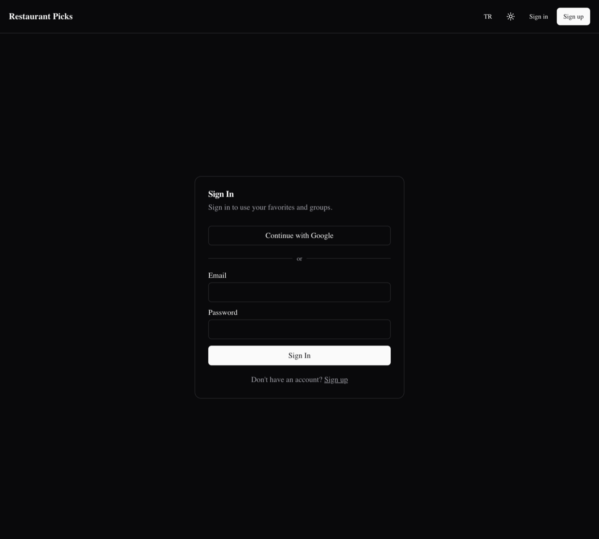

# piton-restoran-oneri

Akıllı restoran ve kafe öneri uygulaması. Kullanıcının konumunu algılar,
çevredeki mekanları harita üzerinde gösterir ve tercihlerine göre öneriler
sunar. PITON Technology take-home projesi.

**Canlı demo:** https://piton-restoran-oneri.vercel.app

## Ekran Görüntüleri

Ana sayfa — harita, tercih paneli ve açıklanabilir öneriler (açık tema):


Mutfak filtresi uygulanmış öneriler + koyu tema + İngilizce arayüz:


Giriş ekranı (Google ve e-posta/şifre):



## Stack

- **Next.js 14** (App Router, TypeScript) + **Tailwind CSS** + **shadcn/ui**
- **Firebase Auth** — Google ve e-posta/şifre ile giriş (anonim giriş kapalı)
- **Neon Postgres** — favoriler, gruplar, tercihler için kalıcı veri
- **Leaflet** + **react-leaflet** — harita
- **Overpass API** (OpenStreetMap) — mekan verisi, `/api/places` üzerinden proxy
- **Zustand** + **Zod** — istemci durumu ve doğrulama
- **next-themes** — karanlık/açık tema; **Vitest** — birim testler

## Mimari

Backend ayrı bir sunucu değildir: `app/api/*` route handler'ları Vercel
Serverless Functions olarak frontend ile birlikte deploy edilir.

```
Tarayıcı → Next.js sayfaları → app/api/* → (Overpass | Neon | Firebase Admin)
                              ↘ Firebase Auth (istemci tarafı)
```

- Harita ve mekan listeleme **herkese açık** (giriş gerektirmez)
- Favoriler / gruplar / tercihler **giriş gerektirir**

## Özellikler

- **Konum + harita:** Tarayıcı Geolocation API'si, kullanıcı işareti, mekan işaretçileri (izin reddedilirse Eskişehir merkez).
- **Canlı mekan verisi:** Overpass'tan restoran/kafe/fast-food; isim, mutfak, adres, mesafe.
- **Tercih paneli:** Mutfak türleri, maksimum mesafe, fiyat tercihi — anında öneriye yansır.
- **Öneri motoru:** Ağırlıklı, açıklanabilir puanlama (aşağıda).
- **Favoriler:** Optimistik ekle/çıkar, sayfa yenilense bile Postgres'ten geri yüklenir.
- **Gruplar:** Grup oluşturma, üyelik rolleri (owner/admin/member), paylaşılan grup favorileri, e-posta daveti.
- **Karanlık mod:** `next-themes` ile sistem/açık/koyu tema, tercih kalıcı.
- **Çok dil (TR/EN):** Hafif istemci tarafı i18n; dil seçimi `localStorage`'da saklanır.
- **AI sohbet asistanı:** Vercel AI Gateway + yakındaki gerçek mekan listesi; uydurma yok.

## Öneri Algoritması

Saf, deterministik bir fonksiyon (`lib/recommend.ts`). Önce sert filtre: `maxDistanceKm`
dışındaki mekanlar elenir. Kalanlar 0–100 arası puanlanır:

```
toplam = 0.35·mesafe + 0.35·mutfak + 0.15·fiyat + 0.15·geçmiş
```

| Bileşen | Kural |
|---------|-------|
| Mesafe | `100 · (1 − mesafe/maxMesafe)` — yakın olan kazanır |
| Mutfak | Tam eşleşme 100, mutfak etiketi yok 30, tercih yok 50, eşleşmiyor 0 |
| Fiyat | Eşleşme 100, bilinmiyor/nötr 50, uyuşmazlık 0 (etiket yoksa sezgisel tahmin) |
| Geçmiş | Favorilerde 100, favori mutfağa benziyor 70, değilse 0 |

Eşitlik bozucu: önce kısa mesafe, sonra alfabetik isim. İlk 10 mekan
"Senin İçin En Uygun Mekanlar" başlığı altında, puan ve gerekçe rozetleriyle gösterilir.

> OSM fiyat etiketleri Türkiye'de seyrek; fiyat tahmini sezgiseldir (`fast_food`/`cafe` → ekonomik, lüks mutfaklar → premium). Bu sınırlama bilinçli bir tercihtir.

## API uçları

| Method | Path | Auth |
|--------|------|------|
| GET | `/api/places` | — |
| GET | `/api/favorites` | ✓ |
| PUT/DELETE | `/api/favorites/:placeId` | ✓ |
| GET/PUT | `/api/me/preferences` | ✓ |
| GET/POST | `/api/groups` | ✓ |
| GET | `/api/groups/:id` | üye |
| GET/POST | `/api/groups/:id/favorites` | üye / owner-admin |
| DELETE | `/api/groups/:id/favorites/:placeId` | owner/admin |
| POST | `/api/groups/:id/invites` | owner/admin |

Tüm korumalı uçlar `Authorization: Bearer <firebaseIdToken>` bekler ve standart hata
zarfı döner: `{ code, message, details?, requestId }`.

## Kurulum

1. Bağımlılıkları yükleyin:

   ```bash
   npm install
   ```

2. Ortam değişkenlerini ayarlayın — `.env.example` dosyasını kopyalayın:

   ```bash
   cp .env.example .env.local
   ```

   Doldurulması gerekenler:
   - `NEXT_PUBLIC_FIREBASE_*` — Firebase Console > Project settings > Web app
   - `DATABASE_URL` — Neon **pooled** bağlantı dizesi
   - `FIREBASE_ADMIN_*` — korumalı route'lar için servis hesabı (Phase 2)

3. Veritabanı şemasını oluşturun (Neon SQL editor veya psql ile):

   ```bash
   psql "$DATABASE_URL" -f db/migrations/001_initial.sql
   psql "$DATABASE_URL" -f db/migrations/002_phase2.sql
   ```

4. Geliştirme sunucusunu başlatın:

   ```bash
   npm run dev
   ```

   - Harita: <http://localhost:3000>
   - Mekan API: <http://localhost:3000/api/places?lat=39.77&lng=30.52&radius=1500>

## Docker ile çalıştırma

`next.config.mjs` içinde `output: "standalone"` ayarı sayesinde imaj küçük kalır.
`NEXT_PUBLIC_*` değişkenleri build sırasında istemci paketine gömüldüğü için
`docker compose` bunları `.env.local`'den okur.

```bash
# .env.local doldurulduktan sonra:
docker compose up --build
# → http://localhost:3000
```

## Komutlar

| Komut | Açıklama |
|-------|----------|
| `npm run dev` | Geliştirme sunucusu |
| `npm run build` | Production build |
| `npm run start` | Production sunucu |
| `npm run lint` | ESLint |
| `npm test` | Vitest birim testleri (öneri motoru) |

## Testler

Öneri motorunun çekirdeği saf ve deterministik olduğu için birim testlerle
doğrulanır (`lib/recommend.test.ts`, `lib/cuisine.test.ts`): sert mesafe filtresi,
ağırlıklı puanlama, eşitlik bozucular, mutfak eşleştirme (Türkçe karakter dâhil)
ve fiyat sezgileri.

```bash
npm test
```

## Deploy (Vercel)

1. Repoyu Vercel'e import edin (framework: Next.js)
2. `.env.example` içindeki tüm değişkenleri Production + Preview ortamlarına ekleyin
3. **AI sohbet** için Vercel projesinde [AI Gateway](https://vercel.com/docs/ai-gateway) etkinleştirin veya `AI_GATEWAY_API_KEY` ekleyin
4. Deploy sonrası Vercel domain'ini Firebase **Authorized domains** listesine ekleyin (Google girişi için)

## Yol haritası

- **Phase 1 (tamam):** İskelet, harita + mekanlar, Firebase Auth (Google + e-posta), Neon şeması
- **Phase 2 (tamam):** Favoriler & gruplar API'ları, öneri motoru + UI, tercih paneli, Docker
- **Phase 3 (kısmen tamam):** Karanlık mod ✓, çok dil (TR/EN) ✓, birim testler ✓, AI sohbet ✓ · (kalan: değerlendirmeler/aktivite akışı)
