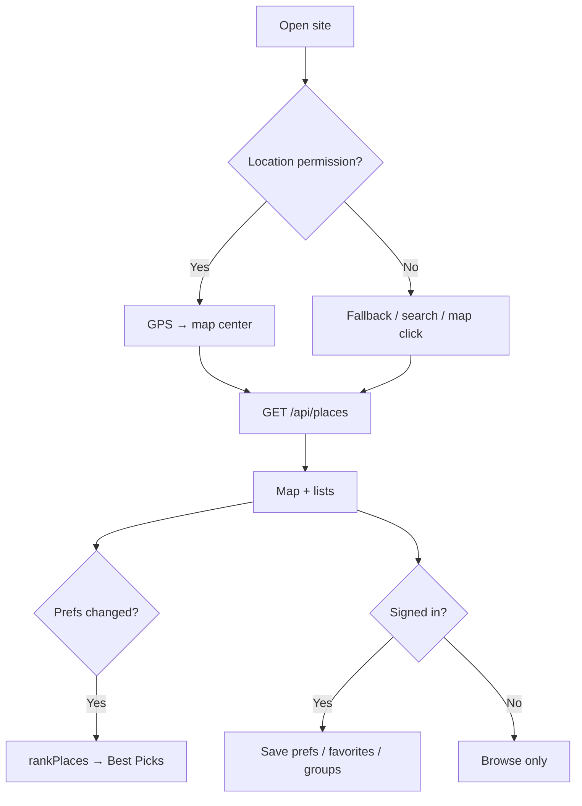

# Usage and technical choices

PDF **§4 README — Usage**: rationale for technical decisions and application flow.

| | |
|---|---|
| **Setup** | [README.md](./README.md) |
| **File structure** | [STRUCTURE.md](./STRUCTURE.md) |
| **Delivery checklist** | [DELIVERY.md](./DELIVERY.md) |

---

## 1. User flow



### Step-by-step scenario

1. **Home** — Map loads; grant location or search city / click map.
2. **Discovery** — **Best Picks for You** (score, max 10) and **Other Nearby Places** (distance, paginated).
3. **Preferences** — Cuisine and max distance; saved to Postgres when signed in; list updates immediately.
4. **Favorites** — Heart icon; requires sign-in; grouped by city on Favorites page.
5. **Groups** — Shared favorite lists (sign-in required).
6. **AI chat** — Recommendations grounded in nearby venues (optional, OpenAI key).

---

## 2. Technical choices and rationale

Aligned with PDF **§2 API and technical suggestions**:

| Area | Choice | Rationale |
|------|--------|-----------|
| **Frontend** | Next.js 14 App Router | PDF suggestion; SSR + API in one repo |
| **UI** | shadcn/ui + Tailwind | PDF suggestion; accessible, fast to ship |
| **State** | Zustand | PDF suggestion; optimistic favorites, lightweight |
| **Backend** | Next.js Route Handlers | No separate server; Vercel serverless |
| **Map** | Leaflet + OSM tiles | PDF suggestion; no map API key |
| **Venue data** | Overpass API | Free, good Turkey coverage; `/api/places` proxy |
| **Address / search** | Nominatim | Missing OSM address tags; `/api/geocode` proxy |
| **Auth** | Firebase (Google + email) | Fast setup, secure token verification |
| **Persistence** | Neon Postgres | See [§2.1](#21-local-data-localstorage--sqlite-alternative) |
| **Deploy** | Vercel | Bonus; auto deploy from main |
| **Tests** | Vitest | Pure modules (`recommend`, `cuisine`) |
| **i18n** | Custom dictionary + context | Bonus; lightweight, `localStorage` locale |

### 2.1 Local data: LocalStorage / SQLite alternative

The PDF suggests **LocalStorage or SQLite** for likes and preferences.

**This project:** Firebase Auth + **Neon Postgres**.

| PDF option | This project | Why |
|------------|--------------|-----|
| LocalStorage | — | No cross-device sync; groups don’t scale |
| SQLite | — | Server-side relational model needed |
| — | **Postgres** | Meets persistence requirement; groups + multi-device |

Zustand is only a **client cache** and optimistic layer; server is source of truth.

### 2.2 Price range preference

The PDF asks for **price range** on the preferences screen.

**This project:** Price preference is **not in the UI**.

OSM `price_range` is sparse in Turkey; heuristics produced misleading scores. Algorithm uses **distance + cuisine** (50% / 50%). DB column `price_preference` may remain for compatibility.

### 2.3 Recommendation algorithm

- Pure: `lib/recommend.ts` → `rankPlaces`
- Favorites do **not** boost score; badges only (`reasons`)
- Cards show **Match: N%** (`totalScore` 0–100)
- Details: [functions/recommend.md](./functions/recommend.md)

---

## 3. CI/CD

PDF bonus: GitHub Actions **lint, test, production build**.

| Step | GitHub Actions | Local |
|------|----------------|-------|
| Lint | ✅ `npm run lint` | ✅ |
| Build | ✅ `npm run build` | ✅ |
| Test | ❌ (not in workflow yet) | ✅ `npm test` |
| Docker build | ✅ verification | ✅ `docker compose up --build` |

Workflow: [`.github/workflows/ci.yml`](../../.github/workflows/ci.yml). Run `npm test` locally before PRs.

---

## 4. Environment variables summary

| Group | Required | Purpose |
|-------|----------|---------|
| `NEXT_PUBLIC_FIREBASE_*` | Yes | Client auth |
| `FIREBASE_ADMIN_*` | Yes | Protected API token verification |
| `DATABASE_URL` | Yes | Runtime Postgres (pooled) |
| `DATABASE_URL_UNPOOLED` | Migrations | Direct connection |
| `OPENAI_API_KEY` | No | AI chat |
| `OVERPASS_URL` | No | Default Overpass endpoint |

Full list: [README.md](./README.md) · `.env.example`

---

## 5. API usage (developers)

Protected routes: `Authorization: Bearer <Firebase ID token>`.

```bash
curl "http://localhost:3000/api/places?lat=39.776&lng=30.520&radius=1500"
curl "http://localhost:3000/api/geocode?q=Eskişehir"
```

Endpoint table: [Root README — API overview](../../README.md#api-özeti)

Türkçe: [docs/tr/USAGE.md](../tr/USAGE.md)
