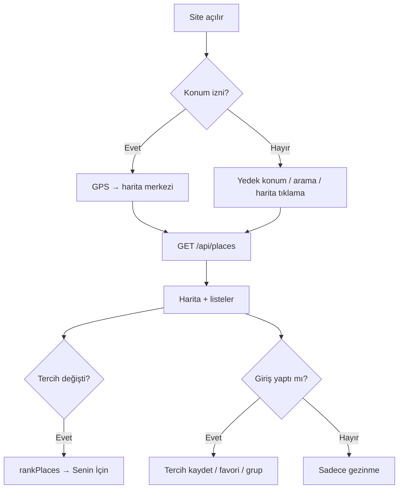

# Kullanım ve teknik tercihler

PDF **§4 README — Kullanım (Usage)**: teknik tercihlerin gerekçeleri ve uygulama akışı.

| | |
|---|---|
| **Kurulum** | [README.md](./README.md) |
| **Dosya yapısı** | [STRUCTURE.md](./STRUCTURE.md) |
| **Teslim checklist** | [DELIVERY.md](./DELIVERY.md) |

---

## 1. Kullanıcı akışı



### Adım adım senaryo

1. **Ana sayfa** — Harita yüklenir; konum izni verilir veya şehir/adres aranır / haritaya tıklanır.
2. **Mekan keşfi** — Sol panelde **Senin İçin En Uygun Mekanlar** (skor, max 10) ve **Diğer Yakın Mekanlar** (mesafe, sayfalı).
3. **Tercihler** — Mutfak ve max mesafe seçilir; giriş yapıldıysa Postgres’e kaydedilir; liste anında güncellenir.
4. **Favori** — Kalp ikonu; giriş gerekir; Favoriler sayfasında şehre göre gruplanır.
5. **Gruplar** — Paylaşımlı favori listeleri (giriş gerekir).
6. **AI sohbet** — Yakındaki gerçek mekan listesine dayalı öneri (opsiyonel, OpenAI key).

---

## 2. Teknik tercihler ve gerekçeler

PDF **§2 API ve Teknik Öneriler** ile uyum:

| Alan | Seçim | Gerekçe |
|------|--------|---------|
| **Frontend** | Next.js 14 App Router | PDF önerisi; SSR + API routes tek repoda |
| **UI** | shadcn/ui + Tailwind | PDF önerisi; erişilebilir, hızlı geliştirme |
| **State** | Zustand | PDF önerisi; favoriler için optimistik UI, hafif |
| **Backend** | Next.js Route Handlers | Ayrı sunucu yok; Vercel serverless |
| **Harita** | Leaflet + OSM tiles | PDF önerisi; API key gerektirmez |
| **Mekan verisi** | Overpass API | Ücretsiz, Türkiye kapsamı yeterli; `/api/places` proxy |
| **Adres / arama** | Nominatim | OSM etiketi eksik adresler; `/api/geocode` proxy |
| **Auth** | Firebase (Google + e-posta) | Hızlı kurulum, güvenli token doğrulama |
| **Kalıcılık** | Neon Postgres | Bkz. [§2.1](#21-lokal-veri-localstorage--sqlite-alternatifi) |
| **Deploy** | Vercel | Bonus; otomatik CI deploy |
| **Test** | Vitest | Saf fonksiyonlar (`recommend`, `cuisine`) |
| **i18n** | Özel sözlük + context | Bonus; hafif, `localStorage` locale |

### 2.1 Lokal veri: LocalStorage / SQLite alternatifi

PDF, beğeniler ve tercihler için **LocalStorage veya SQLite** önerir.

**Bu projede:** Firebase Auth kimliği + **Neon Postgres**.

| PDF seçeneği | Bu proje | Neden |
|--------------|----------|--------|
| LocalStorage | — | Cihazlar arası senkron yok; gruplar/favoriler ölçeklenmez |
| SQLite | — | Sunucu tarafı ilişkisel model (gruplar, üyelik) gerekli |
| — | **Postgres** | Kalıcılık gereksinimini karşılar; gruplar ve çoklu cihaz |

Zustand yalnızca **istemci önbelleği** ve optimistik güncelleme için kullanılır; kaynak gerçeği sunucudadır.

### 2.2 Fiyat aralığı tercihi

PDF tercih ekranında **fiyat aralığı beklentisi** ister.

**Bu projede:** Fiyat tercihi **UI’da yok**.

OpenStreetMap’te Türkiye’de `price_range` etiketi çok seyrek; sezgisel tahmin yanıltıcı skor üretiyordu. Öneri algoritması **mesafe + mutfak** (%50 / %50) ile sadeleştirildi. DB’de `price_preference` sütunu geriye dönük uyumluluk için kalabilir.

### 2.3 Öneri algoritması

- Saf fonksiyon: `lib/recommend.ts` → `rankPlaces`
- Favoriler skoru **yükseltmez**; yalnızca rozet (`reasons`)
- Kartlarda **Uyum: N%** (`totalScore` 0–100)
- Detay: [functions/recommend.md](./functions/recommend.md)

---

## 3. CI/CD

PDF bonus: GitHub Actions ile **lint, test, production build**.

| Adım | GitHub Actions | Yerel |
|------|----------------|-------|
| Lint | ✅ `npm run lint` | ✅ |
| Build | ✅ `npm run build` | ✅ |
| Test | ❌ (henüz workflow’da yok) | ✅ `npm test` |
| Docker build | ✅ doğrulama | ✅ `docker compose up --build` |

Workflow: [`.github/workflows/ci.yml`](../../.github/workflows/ci.yml). PR öncesi `npm test` yerelde çalıştırılmalıdır.

---

## 4. Ortam değişkenleri özeti

| Değişken grubu | Zorunlu | Amaç |
|----------------|---------|------|
| `NEXT_PUBLIC_FIREBASE_*` | Evet | İstemci auth |
| `FIREBASE_ADMIN_*` | Evet | Korumalı API token doğrulama |
| `DATABASE_URL` | Evet | Runtime Postgres (pooled) |
| `DATABASE_URL_UNPOOLED` | Migration | Direct bağlantı |
| `OPENAI_API_KEY` | Hayır | AI sohbet |
| `OVERPASS_URL` | Hayır | Varsayılan Overpass endpoint |

Tam liste: [README.md](./README.md) · `.env.example`

---

## 5. API kullanımı (geliştirici)

Korumalı rotalar: `Authorization: Bearer <Firebase ID token>`.

```bash
# Herkese açık — yakın mekanlar
curl "http://localhost:3000/api/places?lat=39.776&lng=30.520&radius=1500"

# Geocoding
curl "http://localhost:3000/api/geocode?q=Eskişehir"
```

Endpoint tablosu: [Kök README — API özeti](../../README.md#api-özeti)
