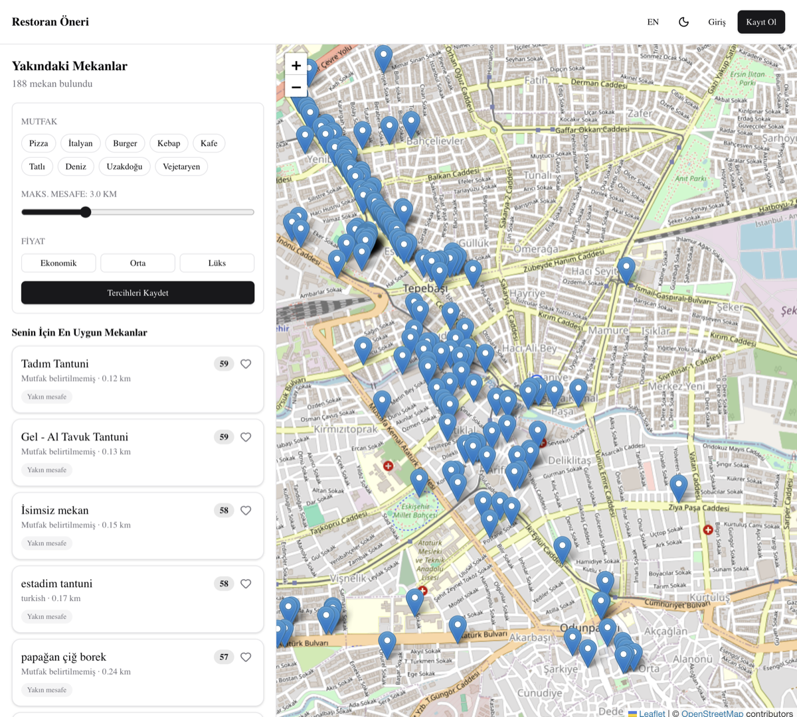
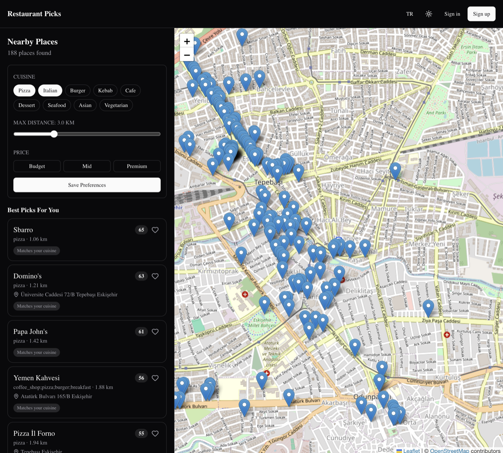

# Açıklamalı ekran görüntüleri

PDF **§4 README — Görseller**: uygulamanın temel ekranlarına ait **açıklamalı** görsel belgeler.

---

## 1. Ana sayfa — açık tema

| Bölge | Açıklama |
|-------|----------|
| **Üst bar** | Logo, Favoriler / Gruplar linkleri, tema ve dil (TR/EN) anahtarları, giriş |
| **Sol panel — Tercihler** | Mutfak seçimi, maksimum mesafe kaydırıcısı, kaydet (giriş gerekir) |
| **Sol panel — Senin İçin** | Öneri algoritması ile sıralı en uygun 10 mekan; **Uyum: N%** rozeti |
| **Sol panel — Diğer Yakın** | Öneriler hariç, mesafeye göre sıralı liste; sayfalama (10/sayfa) |
| **Sağ — Harita** | OpenStreetMap; kullanıcı/arama konumu marker; mekan pinleri |
| **Alt sağ — Sohbet** | AI asistan paneli (OpenAI key ile) |

**Test senaryosu:** Konum izni ver → listede mekanlar görünsün → mutfak filtresi değiştir → **Senin İçin** sırası değişsin.

---

## 2. Ana sayfa — koyu tema, İngilizce

| Bölge | Açıklama |
|-------|----------|
| **Tema** | `next-themes` ile koyu mod; sistem veya manuel seçim |
| **Dil** | Header’daki EN seçimi; arayüz metinleri İngilizce sözlükten |
| **Best Picks** | TR’deki “Senin İçin En Uygun Mekanlar” karşılığı; skor **Match: N%** |

**Bonus kapsam:** PDF §3 — karanlık/aydınlık tema + çoklu dil.

---

## 3. Giriş ekranı

| Bölge | Açıklama |
|-------|----------|
| **Google ile giriş** | Firebase OAuth popup |
| **E-posta / şifre** | Firebase Email/Password |
| **Kayıt linki** | `/register` — yeni hesap |

Giriş sonrası tercihler Postgres’e, favoriler kullanıcıya bağlı kaydedilir.

---

## Eksik görseller (isteğe bağlı eklenebilir)

| Ekran | Öneri |
|-------|--------|
| Favoriler (şehir grupları) | `favorites-by-city.png` |
| Grup detay | `group-detail.png` |
| Tercih paneli yakın plan | `preferences-closeup.png` |

Yeni görüntü eklerken bu dosyayı ve kök [README.md](../../README.md) bölümünü güncelleyin.

English: [docs/en/screenshots/README.md](../../en/screenshots/README.md)
